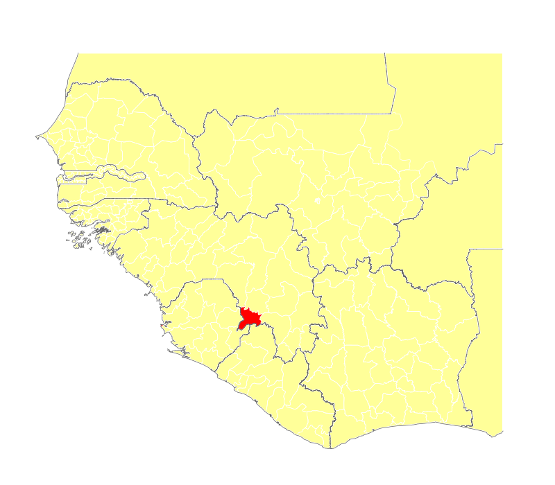

<link href="https://cdnjs.cloudflare.com/ajax/libs/rangeslider.js/1.1.0/rangeslider.min.css" type="text/css">

## Summary

Below is a slider controlled history of Ebola case occurrence obtained from WHO EVD data. 

 
<input onchange='setImage(this)' type="range" min="1" max="64" value="1" step="1" />