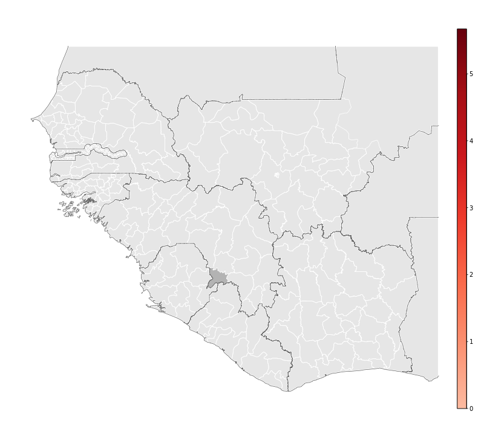

<link rel="stylesheet" href="stylesheets/rangeslider.css" type="text/css">

## Summary

Below is a slider controlled history of Ebola case occurrence obtained from WHO EVD data. 

<output></output>

<input type="range" min="1" max="80" value="1" step="1" data-rangeslider>

