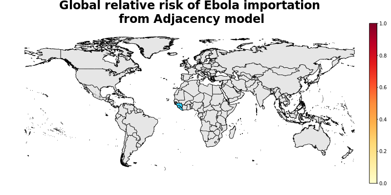
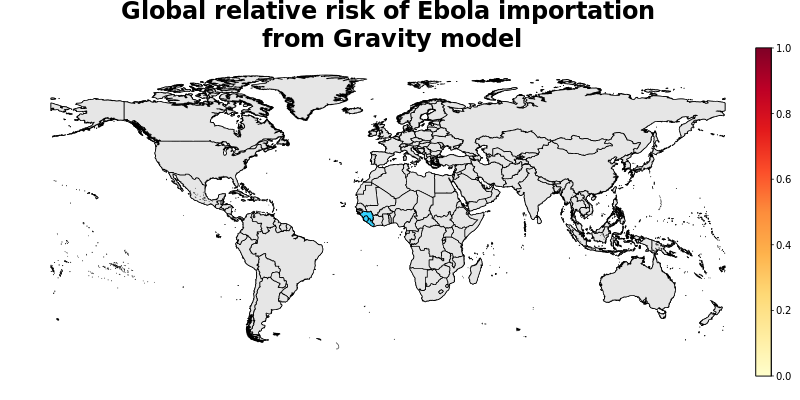
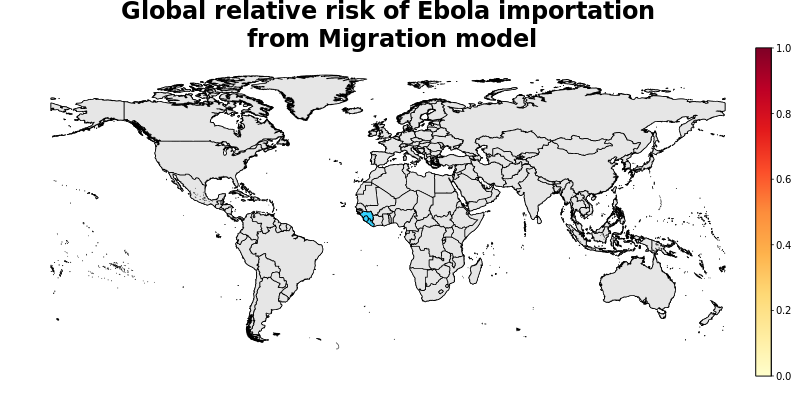

## Summary

The aim of this analysis is to produce a global, national-level metric of the relative risk of Ebola cases being imported by travellers, for each country listed in the INFORM database. In brief, this risk metric 'Importation Risk' is calculated as a weighted average of three separate importation metrics: 'Migration Index', 'Gravity Index' and 'Adjacency Index', each representing a different aspect of human movement. Each of these three indices weights the importation risk by an estimate of the prevalence of the disease in each of the three core countries (Guinea, Liberia and Sierra Leone). Then the three indices are re-scaled independently to a metric of relative importation risk between 0 and 10, in line with other INFORM metrics. The weighting of these three indices in the overall risk metric enables the inclusion of expert opinion about the most likely route of importation for EVD cases.

[Risk of Ebola case importation model methodology][Risk-doc]

[Risk-doc]: http://seeg-oxford.github.io/ebola-spread/risk-doc

<<<<<<< HEAD
### Latest data as of  2015-09-12
=======
### Latest data as of  2015-09-12
>>>>>>> c769d0c6e0d7337f5eb43c7824ea800282b18916

Predicted relative risk of importation of EVD cases from countries with reported cases in the last <b>21</b> days using the overall model. Dark red indicates higher risk of importation. Note that this does not represent a prediction of the number of new cases being reported in the future. Core countries are coloured blue to prevent skew.
[Click here to see an interactive version of the map][geojson-overall]

Predicted relative risk of importation of EVD cases from countries with reported cases in the last <b>21</b> days using the Adjacency model. Dark red indicates higher risk of importation. Note that this does not represent a prediction of the number of new cases being reported in the future. Core countries are coloured blue to prevent skew.
[Click here to see an interactive version of the map][geojson-adjacency]

Predicted relative risk of importation of EVD cases from countries with reported cases in the last <b>21</b> days using the Gravity model. Dark red indicates higher risk of importation. Note that this does not represent a prediction of the number of new cases being reported in the future. Core countries are coloured blue to prevent skew.
[Click here to see an interactive version of the map][geojson-gravity]

Predicted relative risk of importation of EVD cases from countries with reported cases in the last <b>21</b> days using the Migration model. Dark red indicates higher risk of importation. Note that this does not represent a prediction of the number of new cases being reported in the future. Core countries are coloured blue to prevent skew.
[Click here to see an interactive version of the map][geojson-migration]

[geojson-overall]: http://seeg-oxford.github.io/ebola-spread/geojson/global_Overall_prediction
[geojson-adjacency]: http://seeg-oxford.github.io/ebola-spread/geojson/global_Adjacency_prediction
[geojson-gravity]: http://seeg-oxford.github.io/ebola-spread/geojson/global_Gravity_prediction
[geojson-migration]: http://seeg-oxford.github.io/ebola-spread/geojson/global_Migration_prediction
