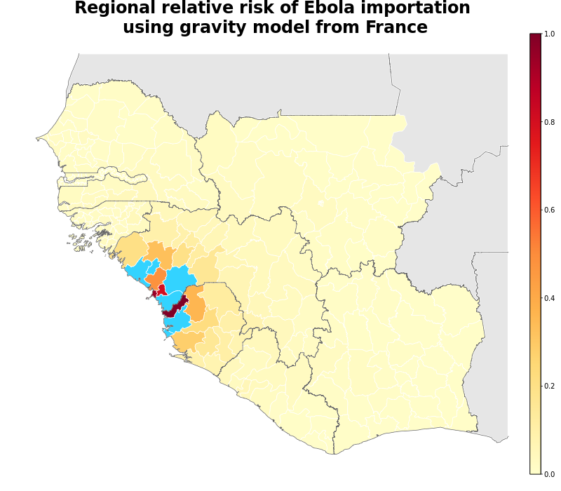
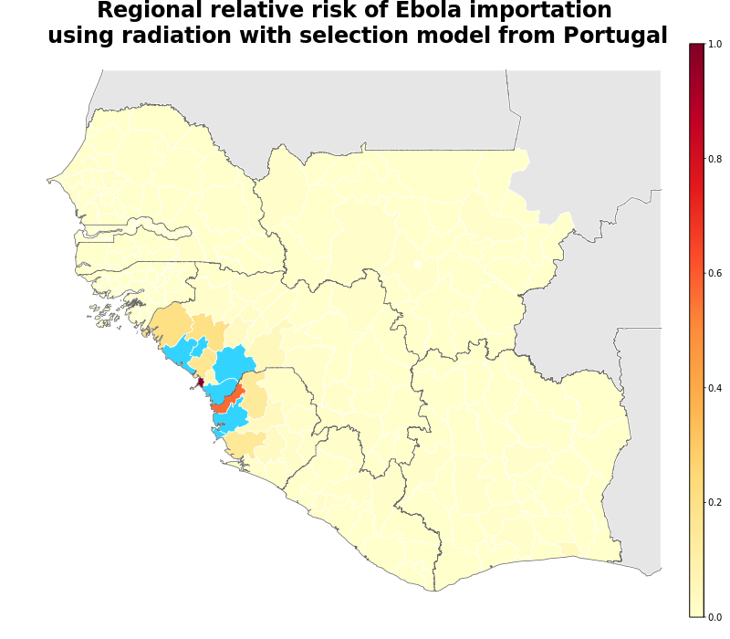
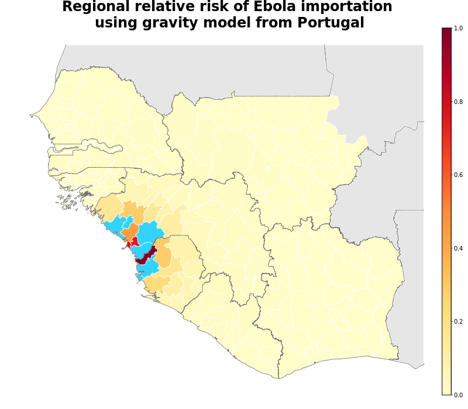
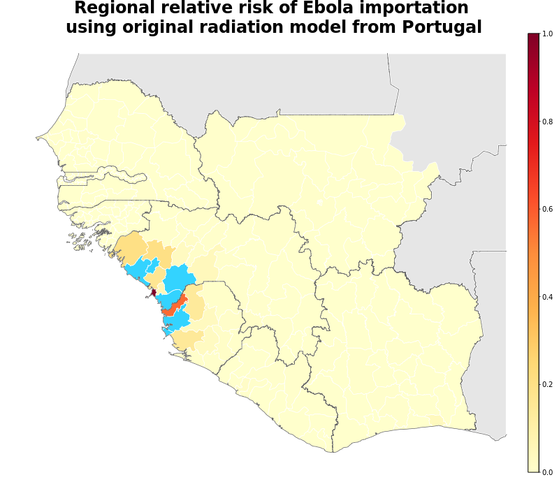
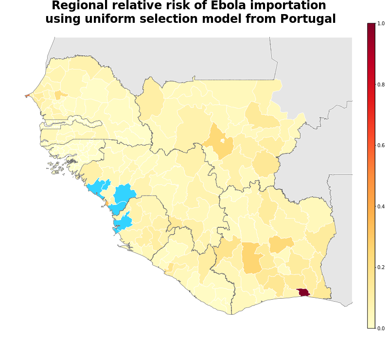
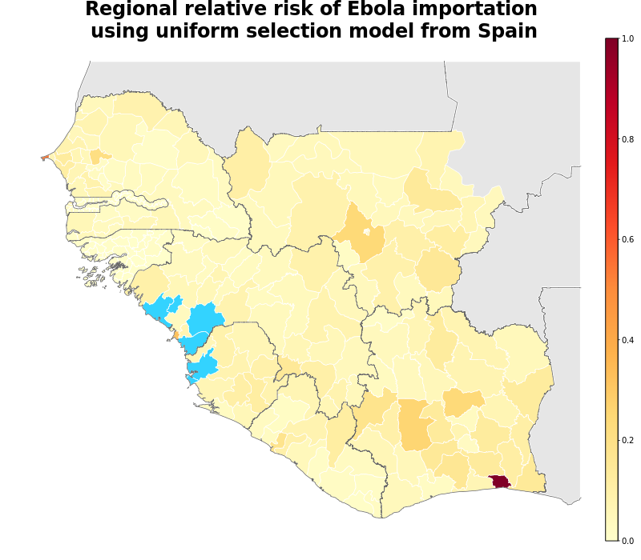

## Summary

This page documents the different movement models that are used to calculate the overall weighted movement model for regional risk prediction. It combines data from 3 European countries (France, Spain and Portugal) each used with 4 different models of human movement (Gravity, Original Radiation, Radiation with Selection, Uniform Selection). The predictions are then weighted based on the AUC value for how effective the previous 3 weeks of case data was at predicting the current week. The individual model risk plots are shown below, and the weightings used to create the weighted risk plot can be downloaded here: [http://seeg-oxford.github.io/ebola-spread/weightings.csv]

[Click here to view an interactive version of the weightings source map][weighting-geojson]

[weighting-geojson]: http://seeg-oxford.github.io/ebola-spread/geojson/Regional_Risk_Source/regional_prediction_source

Predicted relative risk of importation of EVD cases from districts with reported cases in the last <b>21</b> days using the radiation with selection model. Dark red indicates higher risk of importation. Note that this does not represent a prediction of the number of new cases being reported in the future. Districts with reported cases are coloured blue to prevent skew.

Predicted relative risk of importation of EVD cases from districts with reported cases in the last <b>21</b> days using the gravity model. Dark red indicates higher risk of importation. Note that this does not represent a prediction of the number of new cases being reported in the future. Districts with reported cases are coloured blue to prevent skew.

Predicted relative risk of importation of EVD cases from districts with reported cases in the last <b>21</b> days using the original radiation model. Dark red indicates higher risk of importation. Note that this does not represent a prediction of the number of new cases being reported in the future. Districts with reported cases are coloured blue to prevent skew.

Predicted relative risk of importation of EVD cases from districts with reported cases in the last <b>21</b> days using the uniform selection model. Dark red indicates higher risk of importation. Note that this does not represent a prediction of the number of new cases being reported in the future. Districts with reported cases are coloured blue to prevent skew.

Predicted relative risk of importation of EVD cases from districts with reported cases in the last <b>21</b> days using the radiation with selection model. Dark red indicates higher risk of importation. Note that this does not represent a prediction of the number of new cases being reported in the future. Districts with reported cases are coloured blue to prevent skew.

Predicted relative risk of importation of EVD cases from districts with reported cases in the last <b>21</b> days using the gravity model. Dark red indicates higher risk of importation. Note that this does not represent a prediction of the number of new cases being reported in the future. Districts with reported cases are coloured blue to prevent skew.

Predicted relative risk of importation of EVD cases from districts with reported cases in the last <b>21</b> days using the original radiation model. Dark red indicates higher risk of importation. Note that this does not represent a prediction of the number of new cases being reported in the future. Districts with reported cases are coloured blue to prevent skew.

Predicted relative risk of importation of EVD cases from districts with reported cases in the last <b>21</b> days using the uniform selection model. Dark red indicates higher risk of importation. Note that this does not represent a prediction of the number of new cases being reported in the future. Districts with reported cases are coloured blue to prevent skew.

Predicted relative risk of importation of EVD cases from districts with reported cases in the last <b>21</b> days using the radiation with selection model. Dark red indicates higher risk of importation. Note that this does not represent a prediction of the number of new cases being reported in the future. Districts with reported cases are coloured blue to prevent skew.

Predicted relative risk of importation of EVD cases from districts with reported cases in the last <b>21</b> days using the gravity model. Dark red indicates higher risk of importation. Note that this does not represent a prediction of the number of new cases being reported in the future. Districts with reported cases are coloured blue to prevent skew.

Predicted relative risk of importation of EVD cases from districts with reported cases in the last <b>21</b> days using the original radiation model. Dark red indicates higher risk of importation. Note that this does not represent a prediction of the number of new cases being reported in the future. Districts with reported cases are coloured blue to prevent skew.

Predicted relative risk of importation of EVD cases from districts with reported cases in the last <b>21</b> days using the uniform selection model. Dark red indicates higher risk of importation. Note that this does not represent a prediction of the number of new cases being reported in the future. Districts with reported cases are coloured blue to prevent skew.