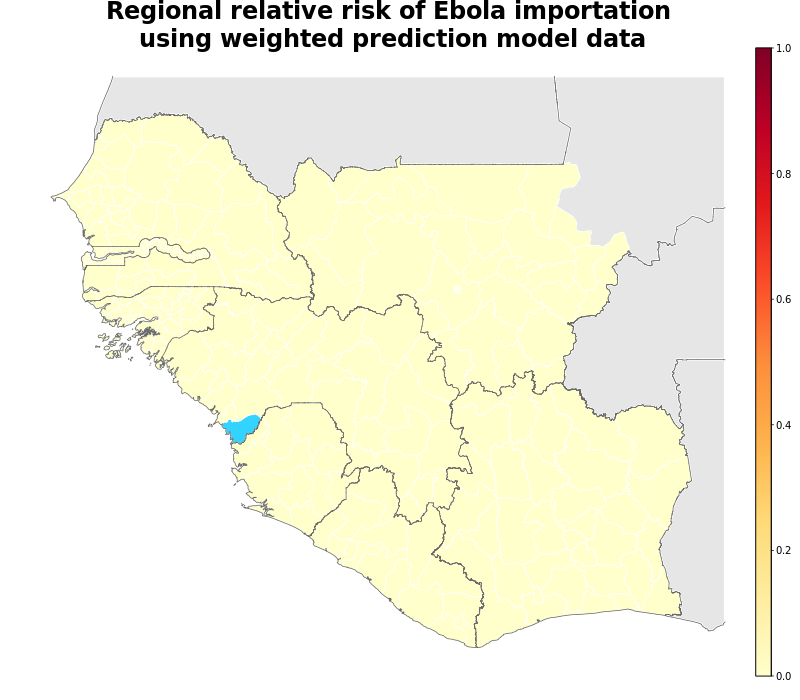

## Summary

The aim of this analysis is to produce a regional, district level metric of the relative risk of Ebola cases being imported by travellers. This includes the core three most affected countries Guinea, Liberia and Sierra Leone. In short, this risk metric 'Importation Risk' is based on a weighted contemporary human movement model (gravity, original radiation and radiation with selection). This movement model then uses the prevalence of the disease in each of the 63 districts to derive a risk of importation. The index is then  re-scaled to a metric of relative importation risk between 0 and 10, in line with other INFORM metrics applied on a global scale. Other human movement models are tested and compared to these estimates and will be shown soon.

[Risk of Ebola case importation model methodology][Risk-doc]

[Risk-doc]: http://seeg-oxford.github.io/ebola-spread/local-risk-doc

### Latest data as of  2016-01-18

[Click here to open this risk map as a zoomable graphic][GeoJsonMap]

[GeoJsonMap]: http://seeg-oxford.github.io/ebola-spread/geojson/Regional_Risk/Regional_Risk

Predicted relative risk of importation of EVD cases from districts with reported cases in the last <b>21</b> days using the weighted movement models. Dark red indicates higher risk of importation. Note that this does not represent a prediction of the number of new cases being reported in the future. Districts with reported cases are coloured blue to prevent skew.

[Weighted model source][Weighted-source]

[Historic case occurrence][Historic-cases]

[Historic case predictions][Historic-prediction]

For the purpose of assessing a spectrum of different movement patterns and to fill in gaps in data availability, we use a variety of movement models and data sources to predict movement in the core countries, Guinea, Liberia, and Sierra Leone.

To evaluate their respective predictive performance in respect to their ability to predict movement between districts we show simple validation statistics: 

[Model Validation Statistics][Validation-statistics]

[Weighted-source]: http://seeg-oxford.github.io/ebola-spread/local-risk-weightings
[Historic-cases]: http://seeg-oxford.github.io/ebola-spread/case-history
[Historic-prediction]: http://seeg-oxford.github.io/ebola-spread/prediction-history
[Validation-statistics]: http://seeg-oxford.github.io/ebola-spread/model-comparisons
