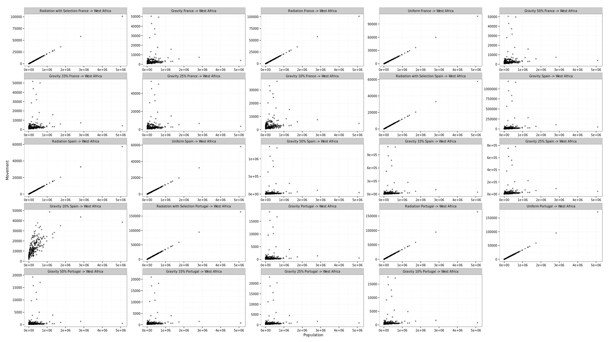
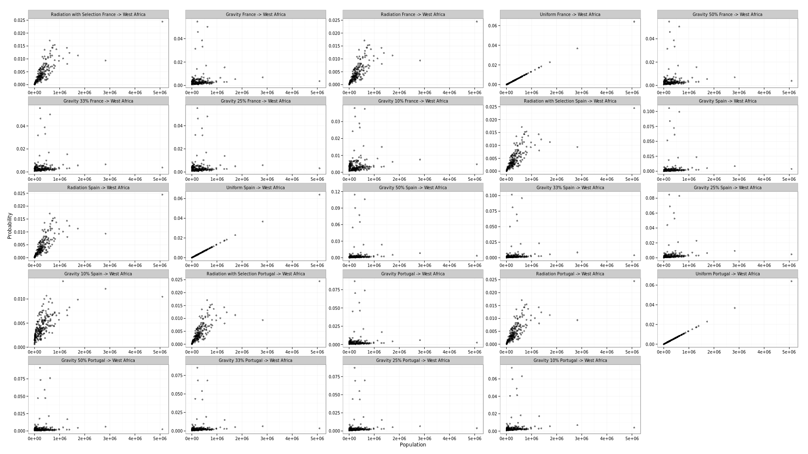
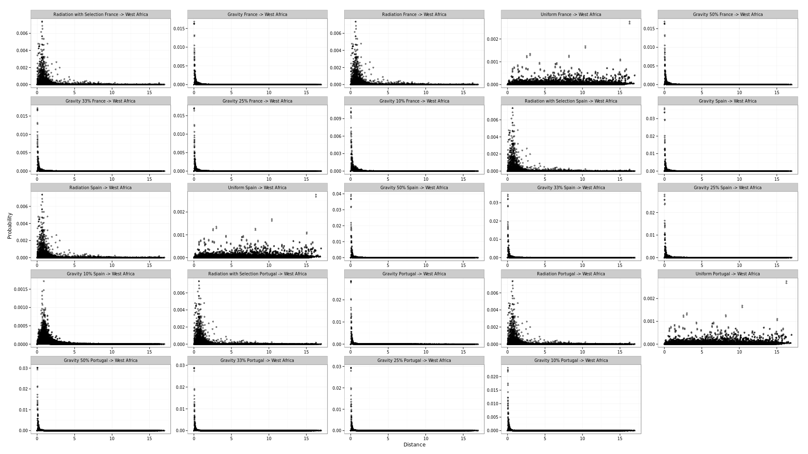

## Introduction

The statistics and analysis are applicable only to the movement models and not to the predictive power of the Ebola spread model as a whole. These are used to assess the predictive abilities of the various movement models particularly when predicting back to their source country. We have also looked at the predicted movement in one country using a model trained on observed data from another country. A simple analysis has been performed to visualise how the models predict movement in West Africa using a number of different statistics.

## Validation Statistics

We are using a cross validation technique to assess the predictive power of the movement models by both comparing how well each model performs against its own training data, as well as how it performs against observed data in other countries. We have plotted the results of the final fitted models in one composite image showing both Source to Source predictions and Source to Other predictions. There are multiple versions of the Gravity model shown in this plot so as to also assess the power of a 9 parameter Gravity model. The percentage shown is the distance cutoff used to filter between the pairs of parameters.

### Model Deviances:

### Model Correlation Coefficients:

## Basic Prediction Analysis

### Prediction of Movement in West Africa based on source district population

### Prediction of Movement probability in West Africa against destination district population

### Prediction of Movement probability in West Africa against distance between regions

