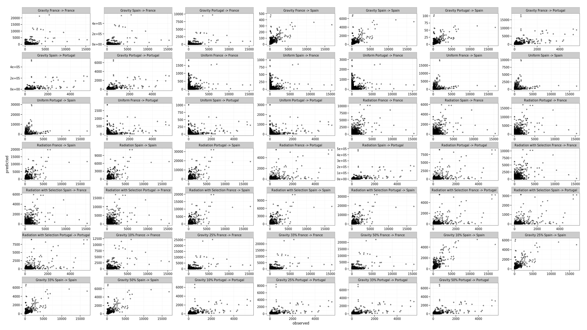

## Validation Statistics

Currently we calculate the deviance of the model against the observed data. We also calculate the correlation coefficient for the model against the predicted data.

We have produced a plot which shows various combinations of predicted vs observed movement data which are shown below.

